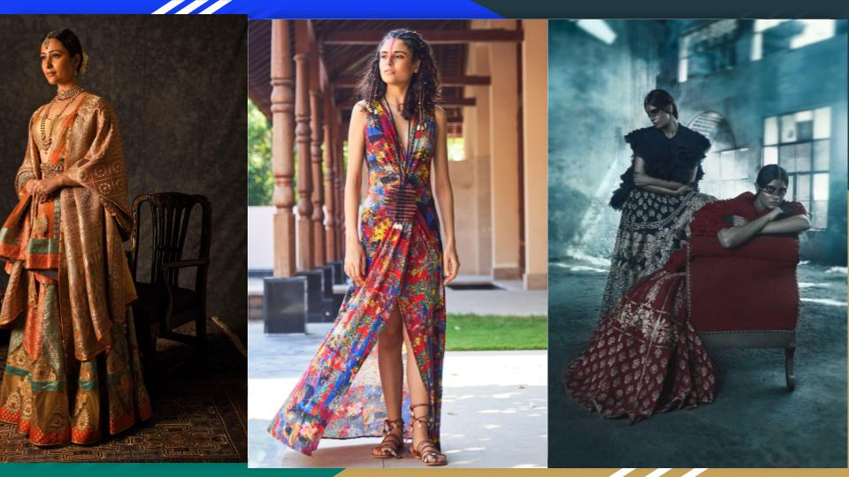

### Top Instagram brands to follow in 2021

Have you ever wanted to setup your business through instagram? These days most
of celebrities are quite active on the platform, which is an apostle of
opportunity, freedom, and unstoppable expression.

Instagram has given voice to lot of us and there can be no other better moment
to take your first steps.

Moveover, for many the presence of a social media platform such as instagram is the
also the first step towards their digital transformation.

Some of the famous fashion brands that have already gained popularity recently,
and are the ones to look for in year 2021 are:

1. [House of CB](https://www.instagram.com/houseofcb/) - It was started by Conna Walker. House of CB is famous for the
   structured look of their piecces. Their [Ellery
   Dress](https://www.houseofcb.com/ellery-white-linen-puff-sleeve-midi-sundress.html)
   is my personal favorite.

2. [Rat & Boa](https://www.instagram.com/ratandboa/) - This brand is famous for their glamourous and edgy style. Look
   their bold prints and eclectic style in [The Athena
   Dress](https://us.ratandboa.com/products/athena) It was  founded by
   Valentina Muntoni and Stephanie Cara Bennet.

3. [Verge Girl](https://www.instagram.com/vergegirl/) - They emanate sense of freedom, confidence, and wish of living
   by their own rules. Verge Girls founders Daniella and Natalia Dionyssiou
   express their feelings through [The full hearts mini
   dress](https://www.vergegirl.com/collections/dresses/products/ml10296#page1-undefined)

4. [Mura Boutique](https://www.instagram.com/mura_boutique/) - You will find happiness, positivity, and natural beauty in
   this brand founded by Asako Nakamura. Have a look at their [Sharona
   Dress](https://www.muraboutique.com.au/collections/dress/products/cm0667b01-white?variant=32136082718822)
   to get the glimpse of easy style.

5. [Peppermayo](https://www.instagram.com/peppermayo/) - Nowhere lesser than others is [The lavender days crop top and
   skirt ](https://www.peppermayo.com/ta3071-lilac) from Peppermayo. You may as
   well sense their ability to bring a cool-girl to life.

We know that these are only a few to start with but are enough to kindle an
inspiration. There are more brands such as Charcoal Cloting, Frankie Phoenix,
and Her Empire Boutique. 

Read more on these inspiring brands from the [post by
Bianca](https://www.missmonro.com/the-best-instagram-fashion-brands-to-watch-in-2021/)

### Phygital version of Lotus Makeup India Fashion Week SS21

Due to situations posed by the ongoing pandemic, Lotus Make-up India Fashion
Week SS21 too its Phygital avatar this year. 

There is nothing that can challenge the indomitable spirit of Fashion world
wide. Fashion industry has gone stronger amid COVID-19 out and are in the open for the
people they serve. 

This years Lotus Make-up Fashion week was conducted between 14th and 18th
October 2020. There were around 40 designers, who showcased their collections
at this unforgettable event. 

Some of the eye catching collections were from designers such as Samanth
Chauhan, Siddhartha Tytler, Tarun Tahulani, and Payal Jain.

Check out some of the amazing collections as reported by [The Fashion
Orientalist](https://www.thefashionorientalist.com/lotus-make-up-india-fashion-week/lotus-make-up-india-fashion-week-ss21/)

### Does Fast Fashion cause Environmental Poverty?

Fast fashion refers to the brands who work in favor of affordable current
styles and produce clothing, footwear, and accessories for the masses to buy
from retail stores. 

Mass production has always remained in limelight for harming our environment
becuase of their contribution to pollution, water wastage, and impact on our
food supply chain.

FashionLitercy brings an article that reminds us of the importance of bringing
changes and amendments to our fast fashion habits via an article by Grace Ganz.

Please read [How Fast Fashion Causes Environmental
Poverty](https://www.borgenmagazine.com/fast-fashion-causes-environmental-poverty/).

We have refined our marketing efforts and have adopted more sane ways to reach
out to our readers. [Subsribe to
FashionLiteracy](https://feedburner.google.com/fb/a/mailverify?uri=Fashionliteracy&amp;loc=en_US)
for more updates. Read our [Free
Newsletter](http://newsletter.fashionliteracy.com) to stay on top of the latest
events in Fashion Design and Technology.

